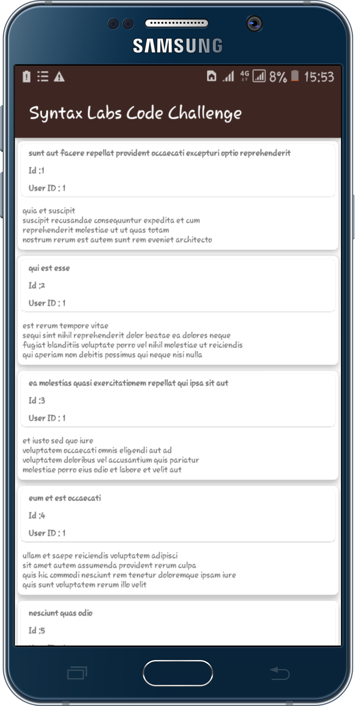

# Syntax Lab Code Challenge

It displays 
<ul>
  <li>List of items from : <a href = "https://jsonplaceholder.typicode.com/posts">https://jsonplaceholder.typicode.com/posts</a></li>
</ul>
 

## Download App
The link to this app can be downloaded here : <a href ="https://drive.google.com/file/d/1DEE2FvTC9EQTGB-Rikq1TWEh1LokQ-xw/view?usp=sharing">Click here to download</a>

## App visual images

## Tools and Libraries used
<ul>
  <li>This app is written 100% in kotlin</li>
  <li>Android Jetpack components used include</li>
    <ul>
      <li>Data Binding - removes many UI framework calls in activities, making them simpler and easier to maintain.
                        It also improve the app's performance and preventing memory leaks and null pointer exceptions
      </li>
      <li>
        Navigation - ensures a consistent and predictable user experience by adhering to an established set of principles.
      </li>
      <li>
        Room - offline data persistence.
      </li>
      <li>
        Work Manager -  schedule deferrable, asynchronous tasks. Used to refresh items retrieved whenever conditions provided are satisfied.
       </li>
       <li>
        View Model - handles lifecycle awareness.
       </li>
       <li>
        Live Data - Data Observation.
       </li>
    </ul>
   <li> GSON - JSON Parser,used to parse requests on the data layer for Entities and understands Kotlin non-nullable and default parameters.</li>

  <li>kotlinx.coroutines - Library Support for coroutines.</li>
  <li>Android KTX  - Influent use of Android APIs</li>
  <li><a href ="https://square.github.io/retrofit/">Retrofit</a> -  retrieving JSON via a REST based webservice.</li>
  <li>Material Design -  Build a nice looking UI.</li>
</ul>
 
  
## Installation
You need a laptop and latest release of android studio(preferred)

## Usage
Clone this project using this link <a href = "https://github.com/MosesWangira/SyntaxCodeChallenge.git">https://github.com/MosesWangira/SyntaxCodeChallenge.git</a> 
Open the project using android studio
